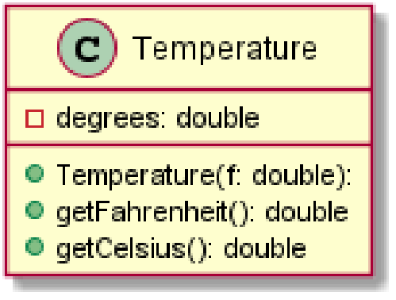
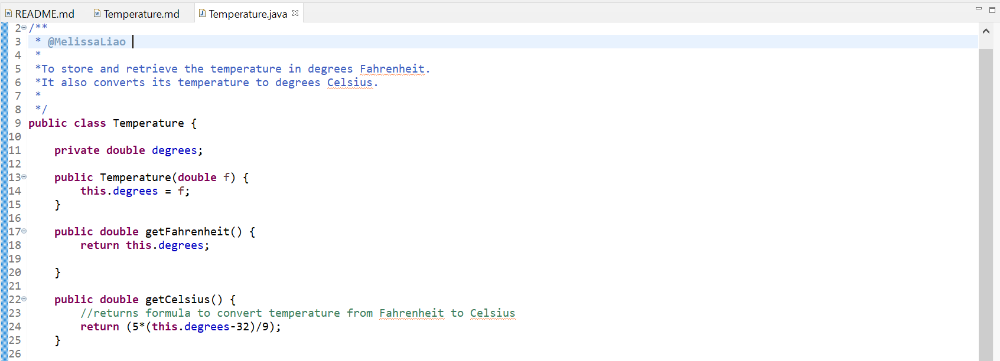
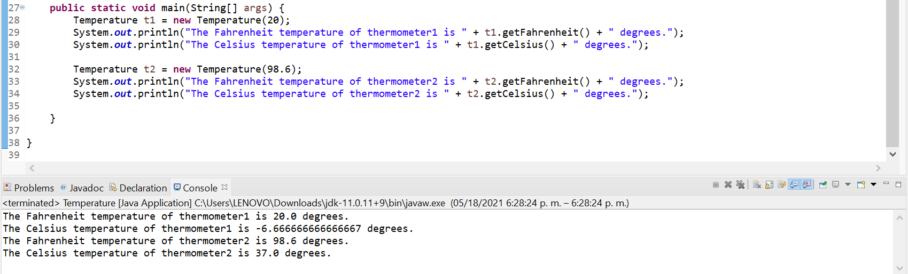

# Temperature report
Author: Melissa Liao

## UML class diagram

## Specification
To store and retrieve the temperature in degrees Fahrenheit. It also converts its temperature to degrees Celsius.

## Execution and Testing

