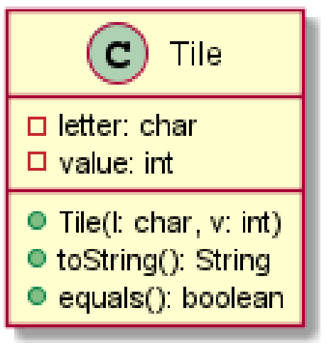
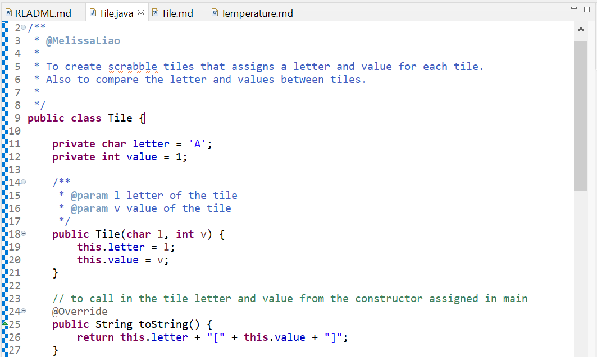
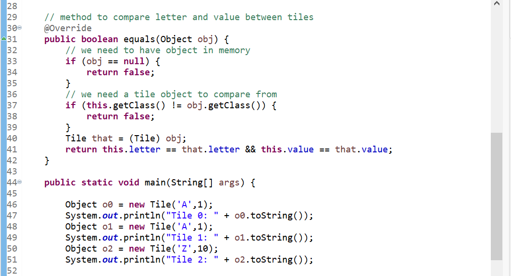
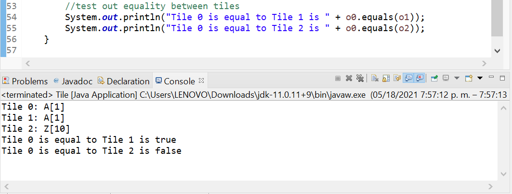

# Tile report
Author: Melissa Liao

## UML class diagram

## Specification
To create scrabble tiles that assigns a letter and value for each tile.
Also to compare the letter and values between tiles.

## Execution and Testing

